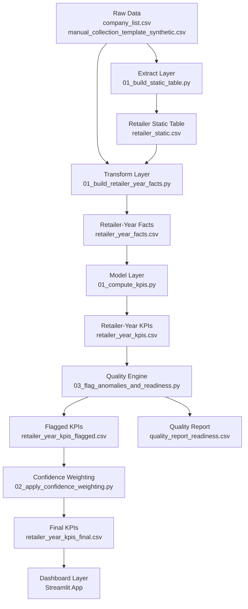

# 📊 E-Retailer KPI Data Pipeline - Watchlist  
*A Data Pipeline, Quality Engine & KPI Product (Synthetic Data)*

---

## 🔍 Project Overview

This project demonstrates the **design, implementation, and iteration of a data product** that tracks growth and efficiency metrics for **European fashion e-commerce retailers** using a **synthetic but realistic dataset**.

The objective is not prediction, but to showcase **how a Project Manager designs decision-ready analytics under real-world data constraints**, including missing values, inconsistent reporting, extreme growth events, and data quality trade-offs.

The project simulates a complete analytics workflow:
- from raw data collection  
- through ETL and KPI modeling  
- to data quality validation, anomaly detection, and stakeholder-ready dashboards  

---

## 🎯 Business Problem

Business users (e.g. analysts, consultants, strategy teams) often ask:

> *Which e-commerce retailers are growing fast — and how much can we trust that conclusion?*

In practice, this is challenging because:
- data is incomplete or inconsistently reported
- extreme growth or decline distorts rankings
- quality issues are rarely communicated explicitly
- KPIs are often consumed without context

This project addresses the problem by **integrating data quality directly into analytical outputs**, rather than treating it as a hidden preprocessing step.

---

## 🧪 Why Synthetic Data?

This project intentionally uses a **synthetic dataset** designed to mimic real-world issues:

- multiple retailers across multiple years (2020–2024)
- mixed currencies (EUR, GBP)
- stable growth, high growth, decline, and volatility
- missing employee data in specific years
- extreme revenue spikes and subsequent crashes
- minor inconsistencies in raw input formatting

Using synthetic data allows:
- full transparency (safe for public GitHub)
- controlled testing of edge cases
- clear demonstration of pipeline robustness
- learning through iteration rather than “happy-path” results

The focus is therefore on **process quality and system behavior**, not on the accuracy of real company figures.

---

## 🧠 Key Concepts Demonstrated

- Data product thinking (decision-driven design)
- Clear definition of data grain (retailer-year)
- Separation of identity, fact, and KPI layers
- Long → wide transformation for analytics
- Explicit data quality flags and readiness scoring
- Anomaly detection without data deletion
- Confidence-weighted rankings
- Iterative improvement based on observed behavior

---

## 🏗️ Data Pipeline Architecture

---

## 📐 Data Model

### Grain
- **One row = one retailer in one year**

### Core Tables
- **Retailer Dimension**: stable retailer identity  
- **Retailer-Year Fact Table**: observed annual metrics  
- **KPI Table**: derived performance indicators  
- **Flagged KPI Table**: KPIs with quality and readiness context  

---

## 📊 KPIs Implemented

- Revenue per employee  
- Year-over-year revenue growth  
- Confidence-weighted revenue per employee  

*KPI computation respects missingness and time ordering; missing inputs remain `NA` and are flagged rather than imputed.*

---

## 🚦 Data Quality & Readiness

Instead of silently cleaning data, the project makes data quality **explicit**.

### Quality Flags
- missing revenue  
- missing employees  
- negative values  
- extreme YoY growth (spikes or crashes)  

### Data Readiness Score
- starts at 100  
- penalized based on severity of quality issues  
- communicates **how confidently results should be used**, not whether they are “true”  

This mirrors real analytics products where trust is as important as computation.

---

## 📈 Dashboard (Streamlit)

The Streamlit dashboard provides:
- KPI overview by year  
- retailer rankings  
- data readiness visibility  
- quality flag summaries  

The dashboard is intentionally simple and explainable, reflecting stakeholder-facing analytics rather than technical experimentation.

## 🔁 Iteration Learnings

This project was intentionally iterated using imperfect synthetic data. Key learnings include:

- Data quality must be explicit, not assumed
Flags and readiness scores prevent misleading conclusions without hiding data.

- KPIs inherit the weaknesses of their inputs
Leaving missing values as NA proved safer than imputation.

- Anomaly detection should contextualize, not delete data
Extreme growth and decline were flagged rather than removed.

- Confidence-weighted metrics improve robustness
Rankings that incorporate data quality are more decision-safe than raw metrics.

- Testing with “bad” data is essential
The pipeline was validated under stress, not just on clean inputs.

These iterations reflect how real data products evolve in practice.

## 📌 Notes

All data is synthetic and for demonstration purposes only.
The project prioritizes clarity, robustness, and explainability over scale or complexity.
The structure and logic are designed to be transferable to real-world datasets.

This repository was created as a learning and portfolio project to demonstrate data product design and data project management capabilities.
